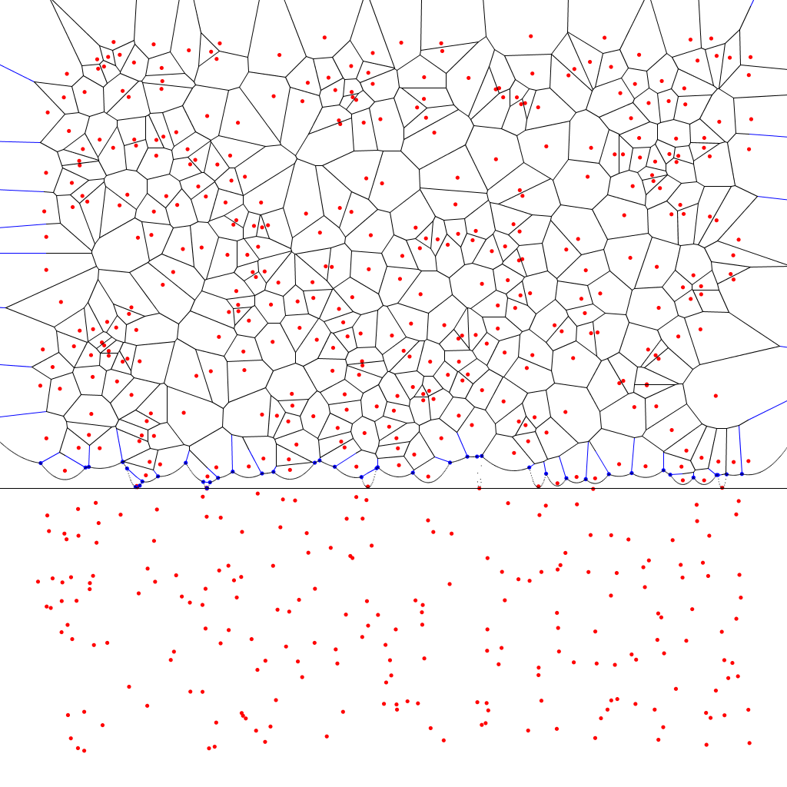

fortune
=======

Fortune's algorithm for Voronoi diagram creation implemented in Java.

This implementation is based on the description of the algorithm from [Computational Geometry: Algorithms & Applications](http://www.amazon.com/Computational-Geometry-Applications-Mark-Berg/dp/3642096816).
A short report documenting the design of this implementation can be found [here](/REPORT.md).

Build
-----
```
ant
```

Also the pre-compiled Jar can be found in [/dist](/dist)

Run
---

to make it animate the construction of a Voronoi diagram over N random points in the unit square:

```java -jar dist/Voronoi.jar <N>```

to make it run a timing study:

```java -Xmx2G -jar dist/Voronoi.jar```



